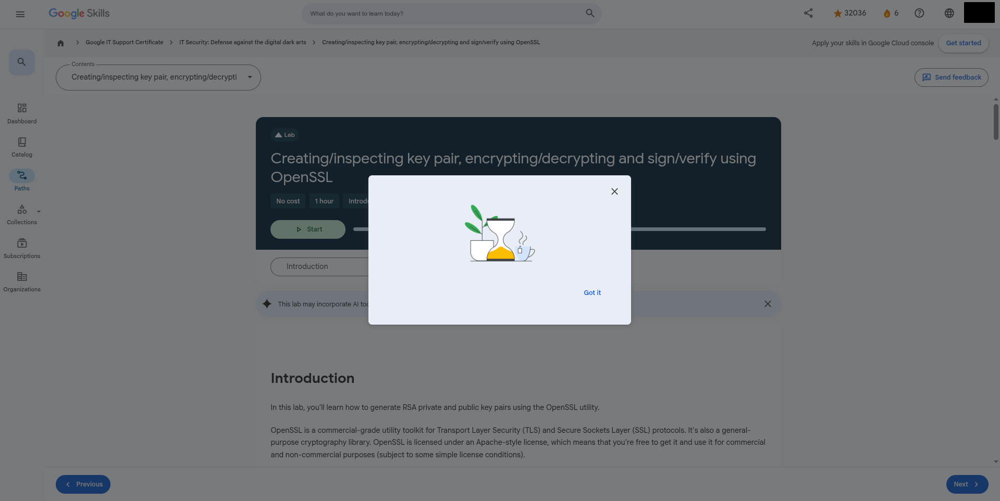

# Google-IT-Support-Certificate

This repository contains scripts and utilities to help you complete the Google IT Support Certificate program on the Qwiklabs/Google Cloud Skills platform.

## Overview

The Google IT Support Certificate consists of 6 courses covering essential IT skills from technical support fundamentals to security. This repository provides tools to bypass progress tracking limitations and unlock all course materials.

## Scripts

### Certificate Progress Bypass Script

#### Summary
This script bypasses the disabled buttons by completing all your progress bars to 100% and enabling the achievement and survey buttons.

#### Features
- Automatically completes remaining courses (System Administration and IT Security)
- Updates all progress bars to 100% completion
- Marks incomplete courses as completed
- Unlocks achievement and survey activities
- Enables disabled buttons by removing disabled attributes
- Intercepts fetch requests to bypass 500 errors
- Provides console notifications for success/failure

#### How to Use
1. Open the Google IT Support Certificate page in your browser
2. Open the developer console (F12 or Ctrl+Shift+I)
3. Copy and paste the entire script into the console
4. Press Enter to execute the script
5. The script will automatically complete all requirements

#### HAVE A NICE DAY
- i'm tired of this.

## Course Structure

The certificate program includes the following courses:

1. **Technical Support Fundamentals** (19 hours)
   - Computer hardware, Internet, software, troubleshooting, and customer service
   
2. **The Bits and Bytes of Computer Networking** (21 hours)
   - Networking technologies, protocols, cloud computing, and network troubleshooting
   
3. **Operating Systems and You: Becoming a Power User** (27 hours)
   - Managing software, users, and configuring hardware
   
4. **System Administration and IT Infrastructure Services** (24 hours)
   - Managing reliable computer systems in multi-user environments
   
5. **IT Security: Defense against the digital dark arts** (22 hours)
   - Security concepts, tools, and best practices to safeguard data and systems
   
6. **Accelerate Your Job Search with AI** (6 hours)
   - Practical strategies and AI tools for job searching

## Future Updates

#### if i have enough time, i will also drop here the automated complete with correct answers in quizzes per course folder

## Disclaimer

These scripts are provided for educational purposes only. Use at your own discretion and responsibility. The repository owner is not responsible for any misuse or consequences of using these tools.
